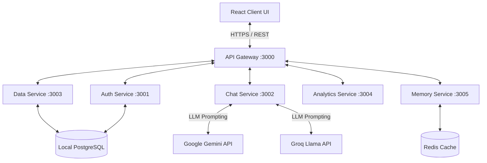

# 🏛️ Campus Mate Architecture

This document describes the high-level architecture of the Campus Mate application, a robust microservices-based learning assistant designed with "The Celestial Architect" aesthetic. 

It covers the service boundaries, data flows, LLM prompt engineering strategies, and the deployment setup on AWS.

---

## 1. High-Level System Architecture

The application uses an **API Gateway** pattern to route requests dynamically to specialized back-end microservices, while communicating with a React Vite client optimized for production inside an Nginx container.

---

## 2. Microservices Breakdown

### API Gateway (`gateway/index.js`)
- **Role:** Central entry point. Validates JWT tokens on protected routes, manages CORS headers, and acts as a reverse proxy for internal inter-service requests.
- **Port:** `3000` internally, mapped publicly in production.

### Auth Service (`services/auth-service/`)
- **Role:** Session management, JWT provisioning, and persistent anonymous user identity creation (`sessionUserId`).
- **Database:** Connects directly to the PostgreSQL pool to insert users.

### Chat Service (`services-isolated/chat-service/`)
- **Role:** The core "Brain" of Campus Mate. It orchestrates user messages against Google Gemini or Groq APIs.
- **Key Implementation Details:**
  * Uses **Native API History Buffers**. Instead of manually stringifying old messages (which causes context amnesia), the service reads the Postgres `chat_messages` table and natively maps `role: model` and `role: user` to the native Gemini/Groq message objects.
  * System Prompts are isolated to `options.systemPrompt` / `systemInstruction` natively to prevent the "Double Context Loop" LLM hallucination.

### Data Service (`services/data-service/`)
- **Role:** Standard CRUD operations representing University artifacts (Classes, Deadlines, Flashcards, Schedule logic).

### Analytics & Memory Services
- **Role:** Processes mood tracking metrics natively and aggregates GPA statistics asynchronously.

---

## 3. UI/UX Design System: "The Celestial Architect"

The frontend interface (`client/src/index.css`) utilizes a stunning custom styling engine.
- **Dim Mode Foundation:** Uses deeply muted Slate Grays (`#0F172A`) instead of pitched black to reduce eye strain.
- **Neon Cyan Zenith:** All interactive components use vibrant High-Vis Cyan (`#00FFFF`), glowing borders, and drop-shadows to emphasize the "spark of AI intelligence."
- **Glassmorphism:** AI response bubbles and modal dialogues have `backdrop-filter: blur(20px)` and transparent background opacities to establish profound depth.

---

## 4. EC2 Production Deployment

The platform runs continuously within isolated Docker containers orchestrated via `docker-compose.yml` on a primary AWS t2.micro or t3.medium EC2 instance.

### The Container Stack:
The Docker ecosystem manages identical dev and prod environments:
- `client`: Built statically with Vite, served by `nginx:alpine` routing dynamically.
- `postgres`: Attached to the network with an internally mapped `postgres_data` persistent volume for the entire dataset.
- `api-gateway` / Service Containers: All connect to the internal `api-network` without exposing ports publicly, increasing security.

### CloudWatch Logging:
Each backend Docker container delegates its logs to the **AWS CloudWatch** daemon (`awslogs` driver), funneling errors via the `campus-mate-logs` group utilizing the EC2 auto-attached IAM Role (`CloudWatchAgentServerPolicy`).
